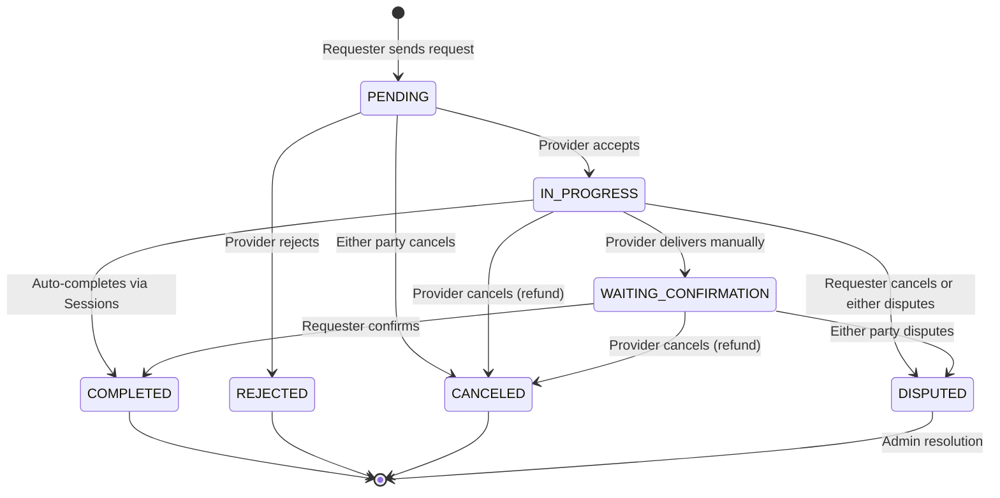

# Wasla Contract & Session System — Architecture, Workflow & UX Guide

A complete reference for how service exchanges (contracts) and work sessions work in Wasla, covering the state machine, escrow mechanics, financial safety guarantees, API endpoints, edge cases, and recommended frontend UX patterns.

---

## Table of Contents

1. [Core Concepts](#1-core-concepts)
2. [Roles & Terminology](#2-roles--terminology)
3. [Contract Status State Machine](#3-contract-status-state-machine)
4. [Session Workflow & Auto-Completion](#4-session-workflow--auto-completion)
5. [Escrow Lifecycle](#5-escrow-lifecycle)
6. [Step-by-Step Workflow](#6-step-by-step-workflow)
7. [API Endpoints Reference](#7-api-endpoints-reference)
8. [Edge Cases & Error Handling](#8-edge-cases--error-handling)
9. [Frontend UX Recommendations](#9-frontend-ux-recommendations)

---

## 1. Core Concepts

Wasla uses a **time-credit economy**. Every exchange between two users is tracked as a **Service Exchange (Contract)** that moves through a defined set of states.
Work is delivered incrementally through **Work Sessions** which log the number of hours worked.

### Key Principles

- **Credits are never deducted on request** — only when the provider accepts.
- **Escrow protects the requester** — credits are frozen (not transferred) until the work is confirmed.
- **Incremental Delivery** — Providers log `WorkSessions` containing the hours worked. Requesters confirm these sessions.
- **Auto-Completion** — When the total confirmed hours equals the contract's total time credits, the contract automatically completes and the provider gets paid.
- **Disputes keep credits frozen** — an admin resolves them manually.

---

## 2. Roles & Terminology

| Term | Definition |
|:---|:---|
| **Requester** (Consumer) | The user who initiates the contract — they are paying time credits for a service. |
| **Provider** | The user who performs the service — they receive time credits after confirmation. |
| **Time Credits** (`duration`) | The payment amount for the exchange. |
| **Completed Hours** | The total hours that have been logged by the provider and confirmed by the requester. |
| **Work Session** | A logged period of work submitted by the provider for the requester to approve. |
| **Escrow** | A financial hold that freezes credits in the requester's account until the exchange settles. |

---

## 3. Contract Status State Machine

---

## 4. Session Workflow & Auto-Completion

Instead of waiting until the very end to mark an entire contract as delivered, the provider can log hours incrementally. 

### Session States
- `PENDING_CONFIRMATION`: Provider logged the hours, waiting for requester.
- `CONFIRMED`: Requester approved the hours. The hours are added to the contract's `completed_hours`.
- `REJECTED`: Requester rejected the logged hours.

### Auto-Completion Mechanic
When a requester confirms a work session, the system checks:
`completed_hours + session.hours === contract.time_credits`
If true:
1. The contract status changes directly to `COMPLETED`.
2. The Escrow is `RELEASED`.
3. The provider's available balance is credited with the total `time_credits`.

---

## 5. Escrow Lifecycle

| Escrow Status | Trigger | Effect on Requester | Effect on Provider |
|:---|:---|:---|:---|
| `NONE` | Contract created / rejected | No change | No change |
| `HELD` | Provider accepts | `available_balance -= duration` `escrow_balance += duration` | No change yet |
| `RELEASED` | Requester confirms delivery OR Sessions auto-complete | `escrow_balance -= duration` | `available_balance += duration` |
| `REFUNDED` | Provider cancels | `escrow_balance -= duration` `available_balance += duration` | No change |

---

## 6. Step-by-Step Workflow

### Phase 1: Request (Requester)
`POST /exchanges/request`
Contract is created with `status: PENDING`, `escrow_status: NONE`. **No credits are deducted yet.**

### Phase 2: Accept / Reject (Provider)
`PUT /exchanges/:id/accept`
System checks if requester has enough `available_balance >= duration`. Contract → `IN_PROGRESS`, escrow → `HELD`.

### Phase 3: Working & Logging Sessions (Provider)
`POST /exchanges/:id/sessions`
Provider logs hours. E.g., for a 5-hour contract, they log 2 hours. Session becomes `PENDING_CONFIRMATION`. 

### Phase 4: Confirming Sessions (Requester)
`PUT /exchanges/:id/sessions/:sessionId/confirm`
Requester confirms the 2 hours. `completed_hours` becomes 2. Contract remains `IN_PROGRESS`.

### Phase 5: Delivery & Completion
There are two ways a contract completes:
1. **Auto-Completion**: The provider logs another session for the remaining 3 hours. Requester confirms. `completed_hours` hits 5. Contract automatically goes to `COMPLETED` and escrow releases.
2. **Manual Delivery**: The provider calls `PUT /exchanges/:id/deliver`. Contract → `WAITING_CONFIRMATION`. Requester calls `PUT /exchanges/:id/confirm`. Contract → `COMPLETED`.

---

## 7. API Endpoints Reference

All endpoints require `Authorization: Bearer <token>`.

### Contract Endpoints

| Method | Path | Who | Description |
|:---|:---|:---|:---|
| `POST` | `/exchanges/request` | Requester | Create a new contract request |
| `GET` | `/exchanges` | Either | List contracts with filtering & pagination |
| `GET` | `/exchanges/:id` | Participant | View a specific contract |
| `PUT` | `/exchanges/:id/accept` | Provider | Accept a pending request (freezes escrow) |
| `PUT` | `/exchanges/:id/reject` | Provider | Reject a pending request |
| `PUT` | `/exchanges/:id/deliver` | Provider | Mark work as delivered entirely |
| `PUT` | `/exchanges/:id/confirm` | Requester | Confirm delivery (settles payment) |
| `PUT` | `/exchanges/:id/cancel` | Either | Cancel or escalate to dispute |
| `POST` | `/exchanges/:id/dispute` | Either | Open a dispute on active exchange |

### Session Endpoints

| Method | Path | Who | Description |
|:---|:---|:---|:---|
| `GET` | `/exchanges/:id/sessions` | Either | List all sessions for a contract |
| `POST` | `/exchanges/:id/sessions` | Provider | Log a new work session (`hours`, `notes`) |
| `PUT` | `/exchanges/:id/sessions/:sessionId/confirm` | Requester | Approve the session's hours |
| `PUT` | `/exchanges/:id/sessions/:sessionId/reject` | Requester | Reject the session |

### Deadline Endpoints

| Method | Path | Who | Description |
|:---|:---|:---|:---|
| `POST` | `/exchanges/:id/deadline` | Either | Propose a new deadline date |
| `PUT` | `/exchanges/:id/deadline/approve` | Other Party | Approve the proposed deadline |
| `PUT` | `/exchanges/:id/deadline/reject` | Other Party | Reject the proposed deadline |

---

## 8. Edge Cases & Error Handling

### Session Validation Edge Cases
- **Over-logging hours**: The provider cannot log a session if `completed_hours + pending_session_hours + new_hours > time_credits`. This throws a `400 Bad Request` ("Total recorded hours cannot exceed agreed time credits").
- **Confirming non-pending sessions**: A session must be `PENDING_CONFIRMATION` to be approved or rejected.

### General Edge Cases
- **Insufficient balance during acceptance**: If the requester spends their available balance on something else between the time of requesting and the provider accepting, the Accept action will fail with a `400` ("Requester no longer has enough time credits").
- **Canceling an active contract**: 
  - If the *Provider* cancels while `IN_PROGRESS`, the contract cancels and escrow is immediately refunded to the requester.
  - If the *Requester* attempts to cancel while `IN_PROGRESS`, they cannot unilaterally take their credits back. The system escalates it to `DISPUTED` instead.

### Error Codes
| HTTP Code | Error Message |
|:---|:---|
| `400` | "Insufficient time credits" or "Total recorded hours cannot exceed..." |
| `403` | "Only the provider can record a session" / "Only the requester can confirm sessions" |
| `404` | "Contract not found" / "Session not found" |
| `409` | "Exchange is no longer pending" (Race conditions) |

---

## 9. Frontend UX Recommendations

### Session Management UI
- **Progress Bar**: Display a progress bar for the contract showing `completed_hours` out of `time_credits`. E.g. `2 / 5 Hours Completed`.
- **Pending Sessions Alert**: If the user is the requester, show a prominent alert or badge when there are sessions awaiting their confirmation.
- **Log Hours Modal**: For providers, provide a simple modal to log hours. Include validation on the frontend so they cannot input a number that exceeds the remaining unlogged hours.

### Contract Card States

| Status | Color | Icon | Primary Action |
|:---|:---|:---|:---|
| `PENDING` | 🟡 Yellow | Clock | Provider: Accept/Reject. Requester: Cancel. |
| `IN_PROGRESS` | 🔵 Blue | Wrench | Provider: "Log Hours". Requester: "Confirm Sessions". |
| `WAITING_CONFIRMATION` | 🟣 Purple | Check-circle | Requester: "Confirm Delivery". |
| `COMPLETED` | 🟢 Green | Trophy | "Leave Review". |
| `DISPUTED` | 🔴 Red | Alert-triangle | "Under Review" badge. No user actions. |

### Timeline View
Show a vertical timeline on the contract details page that interweaves status changes and work sessions:
- ✅ Contract Accepted (Oct 1)
- ⏳ Session #1: 2 hours logged (Oct 2)
- ✅ Session #1: Confirmed (Oct 2)
- ⏳ Session #2: 3 hours logged (Oct 4)
- ✅ Session #2: Confirmed (Oct 4)
- 🟢 Contract Auto-Completed (Oct 4)
