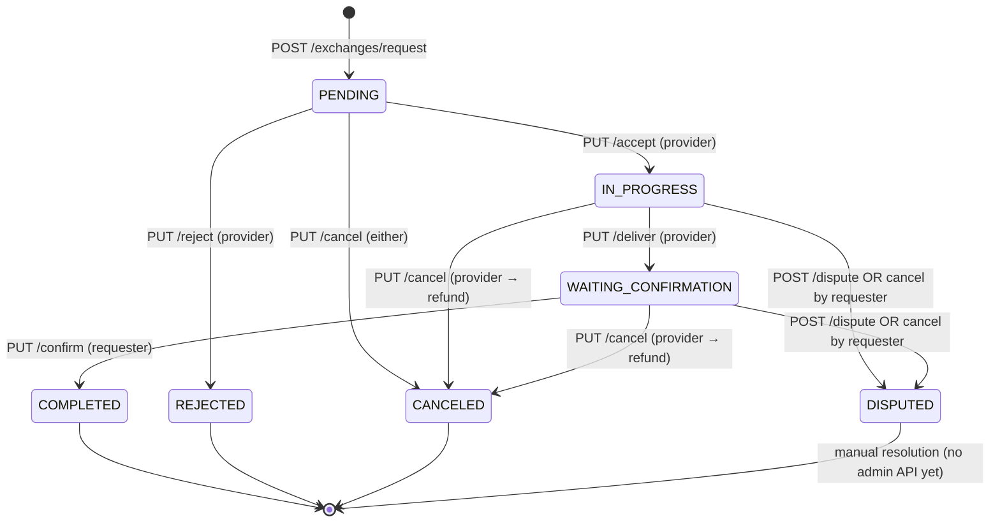

# Wasla Contract Module — Complete Guide

> **Module path:** `src/modules/exchanges/`  
> **Base route:** `/exchanges`  
> **Database table:** `service_exchanges`  
> **Audience:** Backend & frontend developers integrating contracts (service exchanges)

---

## Table of Contents

1. [What Is a Contract?](#1-what-is-a-contract)
2. [Roles & Terminology](#2-roles--terminology)
3. [Money Model (Time Credits & Escrow)](#3-money-model-time-credits--escrow)
4. [Data Model](#4-data-model)
5. [Status State Machine](#5-status-state-machine)
6. [API Reference (All Endpoints)](#6-api-reference-all-endpoints)
7. [Worked Example — Full Lifecycle](#7-worked-example--full-lifecycle)
8. [Work Sessions (Hour Tracking)](#8-work-sessions-hour-tracking)
9. [Deadline Extensions](#9-deadline-extensions)
10. [Notifications](#10-notifications)
11. [Auto-Resolution (Cron)](#11-auto-resolution-cron)
12. [Wallet History Integration](#12-wallet-history-integration)
13. [Reviews](#13-reviews)
14. [Edge Cases & Error Reference](#14-edge-cases--error-reference)
15. [Concurrency & Safety](#15-concurrency--safety)
16. [Frontend Checklist](#16-frontend-checklist)
17. [Known Gaps](#17-known-gaps)

---

## 1. What Is a Contract?

A **contract** (internally: `ServiceExchange`) is a formal agreement between two users to exchange a service for **time credits**.

- The **requester** pays credits.
- The **provider** performs the service and receives credits after completion.
- Credits are protected by an **escrow** hold between acceptance and settlement.

Contracts are always linked to a **post** at creation time and require JWT authentication.

---

## 2. Roles & Terminology

| Term | API field | DB column | Description |
|------|-----------|-----------|-------------|
| **Requester** (consumer) | `requesterId` | `consumer_id` | User who pays credits and requests the service |
| **Provider** | `providerId` | `provider_id` | User who delivers the service |
| **Duration / credits** | `duration` | `time_credits` | Total credits for the contract |
| **Contract deadline** | `contractEndDate` | `maximum_end_date` | Latest date the work should finish |
| **Proposed deadline** | `proposedEndDate` | `proposed_end_date` | Pending extension date (nullable) |
| **Completed hours** | *(sessions only)* | `completed_hours` | Confirmed work hours (session-based completion) |

**Important:** The authenticated user on `POST /exchanges/request` is always the **requester**. You never send `requesterId` in the body.

---

## 3. Money Model (Time Credits & Escrow)

Each user has two balances:

| Field | Meaning |
|-------|---------|
| `available_balance` | Spendable credits |
| `escrow_balance` | Credits frozen for active contracts |

**Invariant (normal operation):**  
`available_balance + escrow_balance` = total credits owned (excluding completed transfers to others).

### When credits move

| Event | Requester | Provider | Escrow status |
|-------|-----------|----------|---------------|
| Request created (`PENDING`) | No change | No change | `NONE` |
| Provider accepts | `available −= duration`, `escrow += duration` | No change | `HELD` |
| Requester confirms delivery | `escrow −= duration`, `services_received++` | `available += duration`, `services_provided++` | `RELEASED` |
| Provider cancels active contract | `escrow −= duration`, `available += duration` | No change | `REFUNDED` |
| Dispute opened | Frozen | Frozen | stays `HELD` |

A `TRANSFER` ledger row is written on confirm. A `REFUND` row is written on provider cancel.

---

## 4. Data Model

### `service_exchanges` (Prisma: `ServiceExchange`)

```typescript
{
  id: number;
  postId: number | null;
  requesterId: number;      // consumer_id
  providerId: number;
  duration: number;         // time_credits
  contractEndDate: string;  // maximum_end_date (ISO)
  proposedEndDate: string | null;
  status: ExchangeStatus;
  escrowStatus: EscrowStatus;
  acceptedAt: string | null;
  deliveredAt: string | null;
  completedAt: string | null;
  canceledAt: string | null;
  createdAt: string;
  updatedAt: string;
  requester: UserSummary;
  provider: UserSummary;
  post: { id, title, category, service_mode } | null;
}
```

### Enums

**`ExchangeStatus`:**  
`PENDING` → `IN_PROGRESS` → `WAITING_CONFIRMATION` → `COMPLETED`  
Also: `REJECTED`, `CANCELED`, `DISPUTED`  
(`ACCEPTED` exists in DB enum but accept sets `IN_PROGRESS` directly.)

**`EscrowStatus`:** `NONE` | `HELD` | `RELEASED` | `REFUNDED`

### Related tables

| Table | Purpose |
|-------|---------|
| `work_sessions` | Provider logs hours; requester confirms/rejects |
| `transactions` | Ledger (`TRANSFER`, `REFUND`) with optional `reference_contract_id` |
| `reviews` | Post-completion ratings (one per participant per contract) |
| `notifications` | In-app alerts with `data.contractId` |

---

## 5. Status State Machine



### Two completion paths

1. **Classic:** Provider delivers → Requester confirms (`PUT /confirm`).
2. **Session-based:** Confirmed work sessions sum to `duration` → auto-completes on last session confirm (see [§8](#8-work-sessions-hour-tracking)).

---

## 6. API Reference (All Endpoints)

All routes require `Authorization: Bearer <accessToken>`.

### 6.1 Create contract

```
POST /exchanges/request
```

**Body:**

```json
{
  "postId": 12,
  "providerId": 5,
  "duration": 5,
  "contractEndDate": "2026-08-01T00:00:00.000Z"
}
```

Legacy alias: `maximumEndDate` is accepted instead of `contractEndDate`.

**Validation:**

- `duration`: positive integer, max 100,000
- `contractEndDate`: must be **strictly in the future**
- Requester ≠ provider
- Post must exist
- Requester `available_balance >= duration` (pre-check only — **no deduction yet**)

**Success:** `201` + `{ exchange }` with `status: "PENDING"`, `escrowStatus: "NONE"`

**Notification:** `EXCHANGE_REQUESTED` → provider

---

### 6.2 List contracts

```
GET /exchanges?role=provider|requester&status=PENDING&page=1&limit=20
```

- Omit `role` → returns contracts where you are provider **or** requester.
- `status` optional filter.
- Offset pagination via `page` / `limit` (default 20, max 50).

**Response:**

```json
{
  "data": [ { "id": 1, "status": "PENDING", "...": "..." } ],
  "meta": { "page": 1, "limit": 20, "total": 3, "totalPages": 1 }
}
```

---

### 6.3 Get one contract

```
GET /exchanges/:id
```

**403** if caller is not provider or requester.

---

### 6.4 Accept (provider)

```
PUT /exchanges/:id/accept
```

- Only provider, only from `PENDING`.
- Atomically holds credits: requester must still have `available_balance >= duration`.
- Sets `IN_PROGRESS`, `escrowStatus: HELD`, `acceptedAt`.

**Edge case:** Requester opened two 5-credit contracts but only has 5 available — first accept succeeds, second returns:

```json
{ "status": "fail", "message": "Requester no longer has enough time credits" }
```

**Notification:** `EXCHANGE_ACCEPTED` → requester

---

### 6.5 Reject (provider)

```
PUT /exchanges/:id/reject
```

- Only provider, only from `PENDING`.
- No balance changes → `REJECTED`.

**Notification:** `EXCHANGE_REJECTED` → requester

---

### 6.6 Deliver (provider)

```
PUT /exchanges/:id/deliver
```

- Only provider, only from `IN_PROGRESS`.
- → `WAITING_CONFIRMATION`, sets `deliveredAt`.
- **No balance change**, **no notification**.

---

### 6.7 Confirm (requester)

```
PUT /exchanges/:id/confirm
```

- Only requester, only from `WAITING_CONFIRMATION`.
- Pays provider, writes `TRANSFER` transaction → `COMPLETED` / `RELEASED`.

**No notification** is sent today.

---

### 6.8 Cancel

```
PUT /exchanges/:id/cancel
```

| Current status | Who cancels | Result |
|----------------|-------------|--------|
| `PENDING` | Either participant | `CANCELED`, no money move |
| `IN_PROGRESS` / `WAITING_CONFIRMATION` | **Provider** | `CANCELED`, escrow **refunded** to requester |
| `IN_PROGRESS` / `WAITING_CONFIRMATION` | **Requester** | → `DISPUTED` (not canceled — credits stay frozen) |

**Notification:** `EXCHANGE_CANCELED` → other party (even when escalated to dispute via requester cancel, the notification type is still `EXCHANGE_CANCELED`).

---

### 6.9 Dispute

```
POST /exchanges/:id/dispute
```

- Either participant.
- Only from `IN_PROGRESS` or `WAITING_CONFIRMATION`.
- → `DISPUTED`, credits remain in escrow.
- **No admin resolution API** exists yet.

---

### 6.10 Work sessions

| Method | Path | Who |
|--------|------|-----|
| `GET` | `/exchanges/:id/sessions` | Participant |
| `POST` | `/exchanges/:id/sessions` | Provider |
| `PUT` | `/exchanges/:id/sessions/:sessionId/confirm` | Requester |
| `PUT` | `/exchanges/:id/sessions/:sessionId/reject` | Requester |

**Create session body:**

```json
{ "hours": 2, "notes": "Fixed plumbing leak" }
```

---

### 6.11 Deadline extension

| Method | Path | Who |
|--------|------|-----|
| `POST` | `/exchanges/:id/deadline` | Provider — body: `{ "proposedEndDate": "..." }` |
| `PUT` | `/exchanges/:id/deadline/approve` | Requester |
| `PUT` | `/exchanges/:id/deadline/reject` | Requester |

On approve: `maximum_end_date = proposed_end_date`, `proposed_end_date = null`.

---

## 7. Worked Example — Full Lifecycle

**Characters:**

- **Sara** (requester, `userId: 10`, balance: 10 credits)
- **Ahmed** (provider, `userId: 5`)
- **Post #12** — "Home plumbing repair", 5 credits

### Step 1 — Sara requests service

```http
POST /exchanges/request
Authorization: Bearer <sara_token>

{
  "postId": 12,
  "providerId": 5,
  "duration": 5,
  "contractEndDate": "2026-08-15T23:59:59.000Z"
}
```

**Result:**

- Contract `#42` → `PENDING`, escrow `NONE`
- Sara balance: **10 available**, 0 escrow (unchanged)
- Ahmed gets notification `EXCHANGE_REQUESTED`

---

### Step 2 — Ahmed accepts

```http
PUT /exchanges/42/accept
Authorization: Bearer <ahmed_token>
```

**Result:**

- Status → `IN_PROGRESS`, escrow → `HELD`
- Sara: **5 available**, **5 escrow**
- Ahmed: unchanged
- Sara gets `EXCHANGE_ACCEPTED`

---

### Step 3 — Ahmed finishes and delivers

```http
PUT /exchanges/42/deliver
Authorization: Bearer <ahmed_token>
```

**Result:**

- Status → `WAITING_CONFIRMATION`
- Balances unchanged (still 5 in escrow)

---

### Step 4 — Sara confirms

```http
PUT /exchanges/42/confirm
Authorization: Bearer <sara_token>
```

**Result:**

- Status → `COMPLETED`, escrow → `RELEASED`
- Sara: **5 available**, 0 escrow, `services_received + 1`
- Ahmed: **+5 available**, `services_provided + 1`
- Ledger: `TRANSFER` 5 credits Sara → Ahmed

---

### Alternative ending — Ahmed cancels mid-work

If Sara accepted (escrow held) and Ahmed cancels:

```http
PUT /exchanges/42/cancel
Authorization: Bearer <ahmed_token>
```

**Result:**

- `CANCELED`, escrow → `REFUNDED`
- Sara gets 5 credits back to `available_balance`
- `REFUND` transaction recorded

---

### Alternative ending — Sara tries to cancel mid-work

```http
PUT /exchanges/42/cancel
Authorization: Bearer <sara_token>
```

**Result:**

- Status → **`DISPUTED`** (not canceled)
- Credits **stay frozen** in escrow
- Ahmed gets `EXCHANGE_CANCELED` notification

---

## 8. Work Sessions (Hour Tracking)

Used when work is tracked in **hours** instead of a single deliver/confirm step.

### Rules

1. Only **provider** can `POST /sessions`.
2. Contract must be `IN_PROGRESS` or `WAITING_CONFIRMATION`.
3. **Hour cap:**  
   `completed_hours + pending_session_hours + new_hours <= duration`
4. Sessions start as `PENDING_CONFIRMATION`.
5. Requester **confirms** or **rejects** each session.

### Example

Contract `#42`, `duration: 5` credits (= 5 hours agreed).

```http
POST /exchanges/42/sessions
{ "hours": 2, "notes": "Day 1 — diagnosis" }
```

→ Session `#1`, `PENDING_CONFIRMATION`  
→ Notification `SESSION_RECORDED` to Sara

```http
PUT /exchanges/42/sessions/1/confirm
```

→ Session `#1` = `CONFIRMED`, `completed_hours = 2`

Provider logs 3 more hours (session `#2`). Sara confirms:

→ `completed_hours = 5` === `duration`  
→ **Auto-complete:** same settlement as `PUT /confirm` (TRANSFER, COMPLETED, RELEASED)

### Edge cases

| Scenario | Error |
|----------|-------|
| Provider logs 4h when only 3h remain | `400` — "Total recorded hours cannot exceed agreed time credits" |
| Requester confirms session twice | `400` — "Session is not pending confirmation" |
| Non-participant lists sessions | `403` |

---

## 9. Deadline Extensions

**Example:** Contract deadline is Aug 1. Ahmed needs more time.

```http
POST /exchanges/42/deadline
{ "proposedEndDate": "2026-08-20T00:00:00.000Z" }
```

→ `proposedEndDate` set on contract  
→ Notification `DEADLINE_PROPOSED` to Sara

Sara approves:

```http
PUT /exchanges/42/deadline/approve
```

→ `contractEndDate` becomes Aug 20, `proposedEndDate` cleared  
→ Notification `DEADLINE_APPROVED` to Ahmed

**Edge cases:**

- Approve/reject without a proposal → `400` "No deadline extension proposed"
- `proposedEndDate` in the past → rejected at validation
- Extension only allowed while `IN_PROGRESS` or `WAITING_CONFIRMATION`

---

## 10. Notifications

Contract notifications are **in-app** with **real-time Socket.IO push** plus REST for history and read state.

| Layer | Mechanism |
|-------|-----------|
| Real-time | Socket.IO `notification:new` on room `user:{userId}` (auto-joined on connect) |
| History | `GET /notifications` (on load, pagination, after reconnect) |
| Mark read | `PATCH /notifications/:id/read`, `PATCH /notifications/read-all` |

No email for contract events.

| Trigger | Type | Recipient |
|---------|------|-----------|
| Request | `EXCHANGE_REQUESTED` | Provider |
| Accept | `EXCHANGE_ACCEPTED` | Requester |
| Reject | `EXCHANGE_REJECTED` | Requester |
| Cancel | `EXCHANGE_CANCELED` | Other party |
| Session recorded | `SESSION_RECORDED` | Requester |
| Session confirmed | `SESSION_CONFIRMED` | Provider |
| Session rejected | `SESSION_REJECTED` | Provider |
| Deadline proposed | `DEADLINE_PROPOSED` | Requester |
| Deadline approved | `DEADLINE_APPROVED` | Provider |
| Deadline rejected | `DEADLINE_REJECTED` | Provider |
| Cron auto-resolve | `CONTRACT_AUTO_RESOLVED` | Both |

**Payload shape:**

```json
{
  "id": "...",
  "type": "EXCHANGE_REQUESTED",
  "title": "طلب خدمة جديد",
  "body": "...",
  "data": { "contractId": 42 },
  "isRead": false,
  "createdAt": "..."
}
```

**Not notified today:** deliver, confirm, dispute.

Notification failures are logged but **never block** the contract action.

---

## 11. Auto-Resolution (Cron)

**Schedule:** every hour (`0 * * * *`) — see `src/common/cron/contract-resolution.cron.ts`

**Targets:** contracts in `IN_PROGRESS` or `WAITING_CONFIRMATION` where `maximum_end_date <= now`.

**Settlement logic:**

```
providerGets = completed_hours
refundToRequester = duration - completed_hours
```

- Pays provider `completed_hours` (if > 0) via TRANSFER
- Refunds remainder to requester via REFUND
- Sets `COMPLETED` / `RELEASED`
- Notifies both parties: `CONTRACT_AUTO_RESOLVED`

### Example

- Contract: 5 credits, deadline passed
- `completed_hours = 3` (from confirmed sessions)
- Provider receives **3**, requester refunded **2**

### Edge case

If `completed_hours = 0` and deadline passes → full refund to requester, provider gets nothing.

---

## 12. Wallet History Integration

`GET /api/v1/wallet/history` includes virtual rows for active/canceled contracts:

| Contract state | Wallet row `status` |
|----------------|---------------------|
| Active escrow (`IN_PROGRESS`, `WAITING_CONFIRMATION`) | `held` |
| `DISPUTED` | `disputed` |
| `CANCELED` (after refund) | `cancelled` |
| Ledger TRANSFER/REFUND | `completed` / `refunded` |

Filter: `?status=held` or `?status=disputed`

---

## 13. Reviews

After `COMPLETED`:

```http
POST /reviews
{
  "serviceExchangeId": 42,
  "rating": 5,
  "comment": "Excellent work, fast and professional."
}
```

**Rules:**

- Only participants
- Contract must be `COMPLETED`
- One review per participant per contract
- Reviewer automatically reviews the **other** party

---

## 14. Edge Cases & Error Reference

### Request phase

| Condition | HTTP | Message |
|-----------|------|---------|
| Self-request | 400 | You cannot request a service from yourself |
| Insufficient balance at request | 400 | Insufficient time credits |
| Post not found | 404 | Post not found |
| Past deadline | 400 | Contract end date must be in the future |

### Accept phase

| Condition | HTTP | Message |
|-----------|------|---------|
| Not provider | 403 | Only the provider can accept this exchange |
| Not pending | 400 | Exchange is not pending |
| Balance spent elsewhere | 400 | Requester no longer has enough time credits |
| Race (already accepted) | 409 | Exchange is no longer pending |

### Active phase

| Condition | HTTP | Message |
|-----------|------|---------|
| Wrong role for action | 403 | *(role-specific message)* |
| Wrong status | 400 | Exchange is not in progress / not awaiting confirmation |
| Concurrent state change | 409 | Exchange is no longer … |

### Account deletion blocked when

- `escrow_balance > 0`
- Any contract in `PENDING`, `ACCEPTED`, `IN_PROGRESS`, `WAITING_CONFIRMATION`, or `DISPUTED`

### Multiple pending requests

A requester **can** open multiple `PENDING` contracts if balance allows at request time. Credits are only frozen on **accept**, so over-commitment is possible until providers accept.

**Example:** Sara has 5 credits, opens three 5-credit requests → all `PENDING` succeed. Only the **first** accept will hold credits; others fail at accept with insufficient credits.

---

## 15. Concurrency & Safety

Financial mutations (`accept`, `confirm`, `cancel` with refund, session auto-complete, cron resolve) run inside **Serializable** transactions with up to **3 retries** on Postgres serialization conflict (`P2034`).

Credit holds use conditional updates:

```typescript
// Accept — only if requester still has enough available
updateMany({ where: { id, available_balance: { gte: time_credits } }, ... })

// Confirm — only if escrow is sufficient
updateMany({ where: { id, escrow_balance: { gte: time_credits } }, ... })
```

This prevents double-spend when two accepts or confirms race.

---

## 16. Frontend Checklist

- [ ] Use `requesterId` / `providerId` from response — never trust client-sent requester id on create
- [ ] Show different actions by role (provider vs requester) and `status`
- [ ] On request: handle `400 Insufficient time credits`
- [ ] On accept: handle `400 Requester no longer has enough time credits`
- [ ] Requester cancel on active contract → expect `DISPUTED`, not `CANCELED`
- [ ] Listen for `notification:new` on socket — do not poll `GET /notifications` on an interval
- [ ] On reconnect, call `GET /notifications?limit=20` to reconcile missed events
- [ ] Navigate via `notification.data.contractId`
- [ ] Disable account delete when active contracts exist
- [ ] Reviews only after `COMPLETED`
- [ ] Wallet: use `held` / `disputed`, not `pending`

---

## 17. Known Gaps

| Gap | Notes |
|-----|-------|
| No notification on deliver / confirm / dispute | Frontend should refresh contract detail after these actions |
| `DISPUTED` has no admin resolve API | Credits frozen indefinitely until manual DB fix or future feature |
| `ACCEPTED` status unused | Accept jumps straight to `IN_PROGRESS` |
| Production DB may lag migrations | e.g. `work_sessions` table missing on some deployments — run `npx prisma migrate deploy` |

---

## Related Files

| File | Purpose |
|------|---------|
| `src/modules/exchanges/exchanges.service.ts` | All business logic |
| `src/modules/exchanges/exchanges.routes.ts` | Route definitions |
| `src/modules/exchanges/exchanges.schema.ts` | Zod validation |
| `src/modules/exchanges/exchange.test.ts` | Integration tests |
| `docs/contract-system.md` | Shorter architecture reference |
| `docs/contract-and-session-system.md` | Session + escrow focus |

---

## Swagger

Interactive docs: `GET /docs`  
OpenAPI JSON: `GET /docs/openapi.json`
