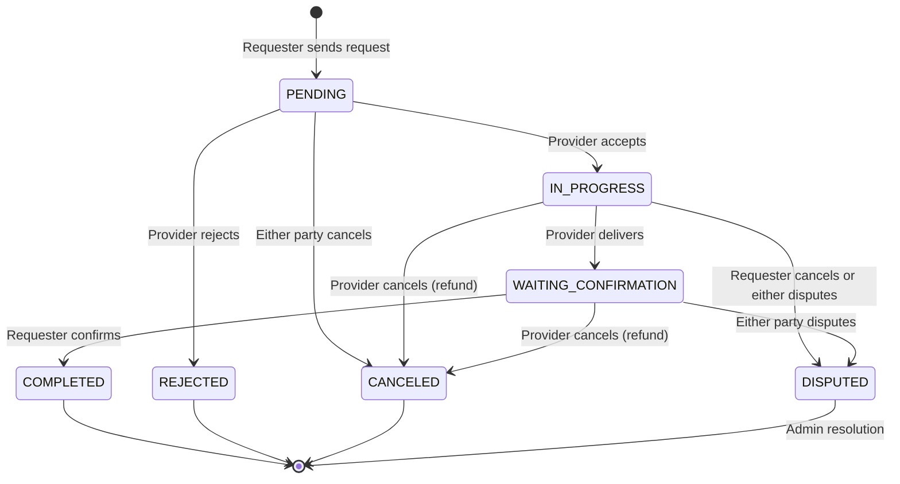
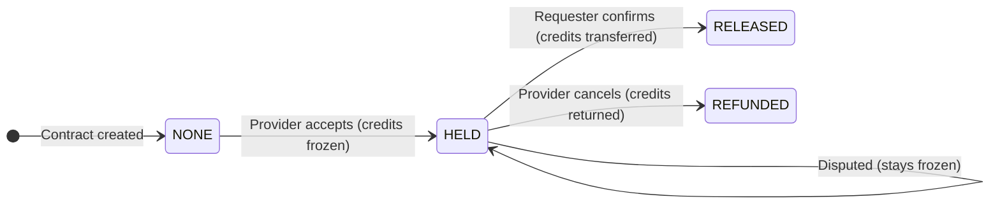
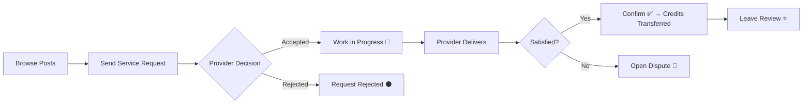
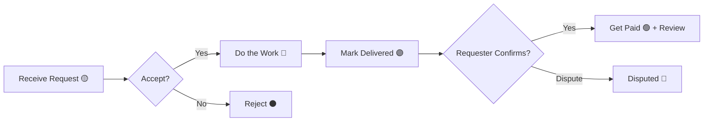

# Wasla Contract System — Architecture, Workflow & UX Guide

A complete reference for how service exchanges (contracts) work in Wasla, covering the state machine, escrow mechanics, financial safety guarantees, API endpoints, and recommended frontend UX patterns.

---

## Table of Contents

1. [Core Concepts](#1-core-concepts)
2. [Roles & Terminology](#2-roles--terminology)
3. [Contract Status State Machine](#3-contract-status-state-machine)
4. [Escrow Lifecycle](#4-escrow-lifecycle)
5. [Step-by-Step Workflow](#5-step-by-step-workflow)
6. [API Endpoints Reference](#6-api-endpoints-reference)
7. [Financial Safety & Concurrency](#7-financial-safety--concurrency)
8. [Post-Exchange Reviews](#8-post-exchange-reviews)
9. [Frontend UX Recommendations](#9-frontend-ux-recommendations)
10. [Error Handling](#10-error-handling)

---

## 1. Core Concepts

Wasla uses a **time-credit economy**. Users earn credits by providing services and spend them by requesting services. Every exchange between two users is tracked as a **Service Exchange (Contract)** that moves through a defined set of states, with an **escrow system** that protects both parties financially.

### Key Principles

- **Credits are never deducted on request** — only when the provider accepts.
- **Escrow protects the requester** — credits are frozen (not transferred) until the requester confirms delivery.
- **The provider gets paid only after confirmation** — ensuring satisfaction-based settlement.
- **Disputes keep credits frozen** — an admin resolves them manually.
- **Double-spend is impossible** — Serializable database transactions prevent race conditions.

---

## 2. Roles & Terminology

| Term | Definition |
|:---|:---|
| **Requester** (Consumer) | The user who initiates the contract — they are paying time credits for a service. |
| **Provider** | The user who performs the service — they receive time credits after confirmation. |
| **Time Credits** (`duration`) | The payment amount for the exchange, denominated in Wasla's time-credit currency. |
| **Escrow** | A financial hold that freezes credits in the requester's account until the exchange settles. |
| **Contract** | A `ServiceExchange` record that tracks the full lifecycle from request to completion. |

### User Balance Fields

Each user has two balances:

| Field | Description |
|:---|:---|
| `available_balance` | Spendable credits (default: 5 for new users as welcome bonus). |
| `escrow_balance` | Frozen credits held for active contracts. Cannot be spent or withdrawn. |

> **Invariant**: `available_balance + escrow_balance` = total credits owned by the user at any given time (minus completed transfers).

---

## 3. Contract Status State Machine



### Status Definitions

| Status | Meaning | Escrow State |
|:---|:---|:---|
| `PENDING` | Waiting for the provider to accept or reject | `NONE` — no credits frozen |
| `IN_PROGRESS` | Provider accepted; work has begun | `HELD` — credits frozen from requester |
| `WAITING_CONFIRMATION` | Provider marked work as delivered; awaiting requester approval | `HELD` — credits still frozen |
| `COMPLETED` | Requester confirmed delivery; credits transferred to provider | `RELEASED` — credits paid out |
| `REJECTED` | Provider declined the request | `NONE` — no credits were ever frozen |
| `CANCELED` | Contract canceled before completion | `NONE` or `REFUNDED` (see below) |
| `DISPUTED` | Escalated; credits stay frozen until admin resolution | `HELD` — credits remain frozen |

---

## 4. Escrow Lifecycle



| Escrow Status | Trigger | Effect on Requester | Effect on Provider |
|:---|:---|:---|:---|
| `NONE` | Contract created / rejected | No change | No change |
| `HELD` | Provider accepts | `available_balance -= duration`, `escrow_balance += duration` | No change yet |
| `RELEASED` | Requester confirms | `escrow_balance -= duration` | `available_balance += duration` |
| `REFUNDED` | Provider cancels | `escrow_balance -= duration`, `available_balance += duration` | No change |

---

## 5. Step-by-Step Workflow

### Phase 1: Request (Requester)

```
POST /exchanges/request
Body: { postId, providerId, duration }
```

1. System validates the requester has enough `available_balance >= duration`.
2. System verifies the post exists and the provider exists.
3. Self-service is blocked (`providerId !== requesterId`).
4. Contract is created with `status: PENDING`, `escrow_status: NONE`.
5. **No credits are deducted** — this allows multiple simultaneous requests.
6. A recommender interaction (`apply`) is synced.

### Phase 2: Accept / Reject (Provider)

**Accept:**
```
PUT /exchanges/:id/accept
```

1. System runs a **Serializable transaction** for atomicity.
2. Atomically checks `requester.available_balance >= duration`.
3. If sufficient: decrements `available_balance`, increments `escrow_balance`.
4. If insufficient (e.g., another contract consumed credits): returns `400`.
5. Contract → `IN_PROGRESS`, escrow → `HELD`, `accepted_at` is set.

**Reject:**
```
PUT /exchanges/:id/reject
```

1. Only the provider can reject. Contract must be `PENDING`.
2. Contract → `REJECTED`. No financial changes.

### Phase 3: Deliver (Provider)

```
PUT /exchanges/:id/deliver
```

1. Only the provider can mark delivery. Contract must be `IN_PROGRESS`.
2. Contract → `WAITING_CONFIRMATION`, `delivered_at` is set.
3. Balances remain unchanged — credits stay in escrow.

### Phase 4: Confirm (Requester)

```
PUT /exchanges/:id/confirm
```

1. System runs a **Serializable transaction**.
2. Releases escrow from requester: `escrow_balance -= duration`.
3. Pays the provider: `provider.available_balance += duration`.
4. Increments `services_received` for requester, `services_provided` for provider.
5. Creates a `TRANSFER` ledger entry in the `transactions` table.
6. Contract → `COMPLETED`, escrow → `RELEASED`, `completed_at` is set.

### Alternative Paths

#### Cancel (Either Party)

```
PUT /exchanges/:id/cancel
```

| Who cancels | From Status | Result |
|:---|:---|:---|
| Either party | `PENDING` | → `CANCELED`, no balance changes |
| **Provider** | `IN_PROGRESS` or `WAITING_CONFIRMATION` | → `CANCELED`, escrow → `REFUNDED` (credits returned to requester) |
| **Requester** | `IN_PROGRESS` or `WAITING_CONFIRMATION` | → `DISPUTED` (requester cannot unilaterally cancel active work; escalated) |

#### Dispute (Either Party)

```
POST /exchanges/:id/dispute
```

1. Either participant can dispute from `IN_PROGRESS` or `WAITING_CONFIRMATION`.
2. Contract → `DISPUTED`. Credits stay frozen in escrow.
3. An admin must manually resolve the dispute.

---

## 6. API Endpoints Reference

All endpoints require `Authorization: Bearer <token>`.

| Method | Path | Who | Description |
|:---|:---|:---|:---|
| `POST` | `/exchanges/request` | Requester | Create a new contract request |
| `GET` | `/exchanges` | Either | List contracts with filtering & pagination |
| `GET` | `/exchanges/:id` | Participant | View a specific contract |
| `PUT` | `/exchanges/:id/accept` | Provider | Accept a pending request (freezes escrow) |
| `PUT` | `/exchanges/:id/reject` | Provider | Reject a pending request |
| `PUT` | `/exchanges/:id/deliver` | Provider | Mark work as delivered |
| `PUT` | `/exchanges/:id/confirm` | Requester | Confirm delivery (settles payment) |
| `PUT` | `/exchanges/:id/cancel` | Either | Cancel or escalate to dispute |
| `POST` | `/exchanges/:id/dispute` | Either | Open a dispute on active exchange |

### List Contracts Query Parameters

| Param | Type | Description |
|:---|:---|:---|
| `role` | `"provider"` or `"requester"` | Filter by the user's role in the contract |
| `status` | `ServiceExchangeStatus` | Filter by contract status |
| `page` | `integer` (default: 1) | Page number |
| `limit` | `integer` (default: 20, max: 50) | Results per page |

### List Response Shape

```json
{
  "data": [
    {
      "id": 42,
      "postId": 100,
      "requesterId": 5,
      "providerId": 12,
      "duration": 3,
      "status": "IN_PROGRESS",
      "escrowStatus": "HELD",
      "acceptedAt": "2026-06-20T10:00:00.000Z",
      "deliveredAt": null,
      "completedAt": null,
      "canceledAt": null,
      "createdAt": "2026-06-20T09:00:00.000Z",
      "updatedAt": "2026-06-20T10:00:00.000Z",
      "requester": {
        "id": 5,
        "username": "ahmed_user",
        "full_name": "أحمد محمد",
        "profile_image": "https://..."
      },
      "provider": {
        "id": 12,
        "username": "sara_dev",
        "full_name": "سارة أحمد",
        "profile_image": "https://..."
      },
      "post": {
        "id": 100,
        "title": "تطوير موقع ويب",
        "category": "OFFER",
        "service_mode": "ONLINE"
      }
    }
  ],
  "meta": {
    "page": 1,
    "limit": 20,
    "total": 1,
    "totalPages": 1
  }
}
```

---

## 7. Financial Safety & Concurrency

### Double-Spend Prevention

The system uses **Postgres Serializable isolation** with automatic retries (up to 3 attempts) for all balance-modifying operations:

```
accept  → Serializable TX: atomic WHERE available_balance >= duration
confirm → Serializable TX: atomic escrow release + provider credit
cancel  → Serializable TX: atomic escrow refund (when provider cancels)
```

**Example scenario**: A requester with 3 credits opens two 3-credit contracts. Both are `PENDING` (no deduction). When Provider A accepts first, the Serializable transaction atomically checks and freezes 3 credits. When Provider B tries to accept, the `WHERE available_balance >= 3` guard fails → returns `400`.

### Escrow Integrity

- Escrow can never go negative (guarded by `WHERE escrow_balance >= amount`).
- Available balance can never go negative (guarded by `WHERE available_balance >= amount`).
- Every financial mutation creates an auditable `Transaction` ledger entry.

### Ledger Entry Types

| Type | Created When | Sender | Receiver |
|:---|:---|:---|:---|
| `TRANSFER` | Requester confirms delivery | Requester | Provider |
| `REFUND` | Provider cancels active contract | Provider | Requester |

---

## 8. Post-Exchange Reviews

After a contract reaches `COMPLETED` status, both participants can leave reviews:

```
POST /reviews
Body: { serviceExchangeId, rating, comment }
```

- Only participants of the completed exchange can review.
- Each participant can only review once per exchange (enforced by a unique constraint).
- Reviews are visible on user profiles via `GET /users/:userId/reviews`.

---

## 9. Frontend UX Recommendations

### Contract Card States

Design your contract card component to reflect each status with distinct visual treatment:

| Status | Color | Icon | Primary Action |
|:---|:---|:---|:---|
| `PENDING` | 🟡 Yellow/Amber | Clock | Provider: Accept/Reject buttons. Requester: Cancel button. |
| `IN_PROGRESS` | 🔵 Blue | Wrench/Gear | Provider: "Mark as Delivered" button. |
| `WAITING_CONFIRMATION` | 🟣 Purple | Check-circle | Requester: "Confirm Delivery" button. |
| `COMPLETED` | 🟢 Green | Trophy/Star | "Leave Review" button (if not reviewed yet). |
| `REJECTED` | ⚫ Gray | X-circle | No actions. Show as archived. |
| `CANCELED` | ⚫ Gray | Ban | No actions. Show refund badge if `escrowStatus === "REFUNDED"`. |
| `DISPUTED` | 🔴 Red | Alert-triangle | "Under Review" badge. No user actions. |

### Suggested Page Structure

```
┌─────────────────────────────────────────────────────┐
│  My Contracts                                       │
│  ┌──────────┐  ┌──────────┐  ┌──────────┐          │
│  │ الجميع   │  │ كمقدم    │  │ كطالب    │          │
│  │  (All)   │  │(Provider)│  │(Requester)│          │
│  └──────────┘  └──────────┘  └──────────┘          │
│                                                     │
│  Filter: [All Statuses ▼]                           │
│                                                     │
│  ┌─────────────────────────────────────────────┐    │
│  │ 📋 تطوير موقع ويب                          │    │
│  │ Provider: سارة أحمد                          │    │
│  │ Duration: 3 credits                          │    │
│  │ Status: 🔵 IN_PROGRESS                       │    │
│  │ Escrow: 🔒 HELD                              │    │
│  │                                              │    │
│  │ [Mark as Delivered]                          │    │
│  └─────────────────────────────────────────────┘    │
│                                                     │
│  ┌─────────────────────────────────────────────┐    │
│  │ 📋 تصميم شعار                               │    │
│  │ Requester: أحمد محمد                         │    │
│  │ Duration: 2 credits                          │    │
│  │ Status: 🟡 PENDING                           │    │
│  │                                              │    │
│  │ [Accept ✓]  [Reject ✗]                       │    │
│  └─────────────────────────────────────────────┘    │
│                                                     │
│  Page 1 of 3  [← Prev] [Next →]                    │
└─────────────────────────────────────────────────────┘
```

### UX Flow Diagrams

#### Requester Journey



#### Provider Journey



### Key UX Guidelines

1. **Show escrow status alongside contract status** — users need to know their credits are safe. Display a lock icon (🔒) with "Credits held in escrow" when `escrowStatus === "HELD"`.

2. **Disable impossible actions** — Only show action buttons that are valid for the current user's role AND the contract's current status. For example:
   - Don't show "Accept" to the requester.
   - Don't show "Confirm" to the provider.
   - Don't show "Mark Delivered" when status isn't `IN_PROGRESS`.

3. **Confirmation dialogs for irreversible actions** — Always confirm before: Accept (freezes credits), Confirm delivery (transfers credits), and Dispute (escalates).

4. **Real-time balance updates** — After accepting or confirming, refresh the user's wallet balance display to reflect the escrow/transfer changes immediately.

5. **Empty states by role** — When filtering by "as provider" or "as requester" shows no results, use encouraging copy like "لم تقدم أي خدمات بعد" (You haven't provided any services yet).

6. **Timeline view for contract detail** — On the contract detail page, show a vertical timeline with timestamps for each milestone:
   ```
   ✅ Created       — 20 June 2026, 09:00
   ✅ Accepted      — 20 June 2026, 10:00
   ✅ Delivered     — 21 June 2026, 14:30
   ⏳ Confirmation  — Waiting...
   ```

---

## 10. Error Handling

### Common Error Responses

| HTTP Code | Error Message | When |
|:---|:---|:---|
| `400` | "You cannot request a service from yourself" | `providerId === requesterId` |
| `400` | "Insufficient time credits" | Requester's `available_balance < duration` at request time |
| `400` | "Requester no longer has enough time credits" | Balance dropped between request and acceptance |
| `400` | "Exchange is not pending" | Trying to accept/reject a non-pending contract |
| `400` | "Exchange is not in progress" | Trying to deliver a non-in-progress contract |
| `400` | "Exchange is not awaiting confirmation" | Trying to confirm before delivery |
| `403` | "Only the provider can accept this exchange" | Requester tries to accept |
| `403` | "Only the requester can confirm this exchange" | Provider tries to confirm |
| `403` | "You are not a participant in this exchange" | Non-participant tries any action |
| `404` | "Exchange not found" | Invalid exchange ID |
| `409` | "Exchange is no longer pending" | Race condition during acceptance |

### Frontend Error Handling Tips

- **400 errors**: Display the error message directly — they are user-friendly Arabic/English strings.
- **403 errors**: This indicates a role mismatch — hide the action button rather than showing an error.
- **409 errors**: Refresh the contract state from the server — the contract moved to a different status.
- **Network errors**: Implement optimistic UI with rollback on failure to keep the experience responsive.
